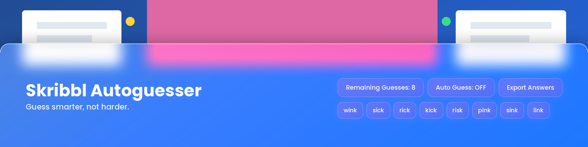
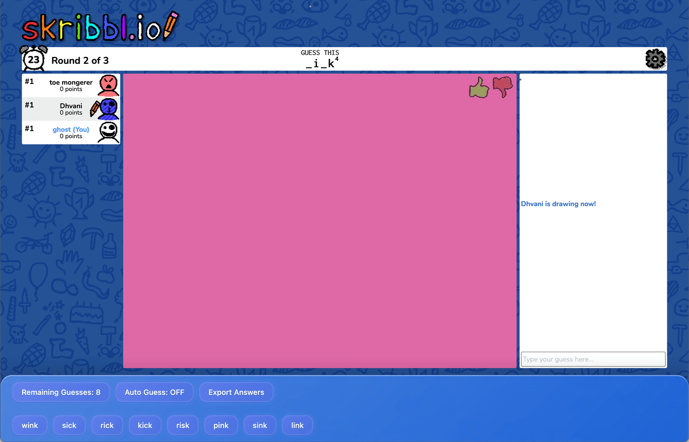

  

  <b>Guesses <a href="https://skribbl.io">skribbl.io</a> words for you.</b> 
  It reads the hint and narrows down the possible words.

  
  
  

## Install

1. Install a userscript manager such as [Tampermonkey](https://www.tampermonkey.net/) or [Violentmonkey](https://violentmonkey.github.io/).
2. Install the script from [Greasy Fork](https://greasyfork.org/en/scripts/SCRIPT-ID).
3. Open [skribbl.io](https://skribbl.io). The panel appears at the bottom of the screen.

## Usage

  

- **Auto Guess:** turn automatic guessing on or off.
- **Remaining Guesses:** how many possible words are left.
- **Export Answers:** save new words to a text file.
- Press `↓` to hide the panel and `↑` to show it.

## Planned features

- **Auto-leave / Auto-change Lobbies:** Automatically leave or change lobbies to avoid getting kicked.
- **Neural Net for Word Sorting:** Plans to use a neural network to improve word sorting, potentially using an open-source model from Google.
- **Humanized Auto-draw:** Simulates human-like drawing behavior, with community support and auto-saving of other players' drawings.
- **Randomized Auto-guess Timing:** Adds randomness to auto-guess timing for more natural behavior.

## Contributing

Contributions are welcome, from new words to bug fixes.

1. Click **Export Answers** to save the new words you find.
2. Open a [pull request](https://github.com/zkisaboss/reorderedwordlist/pulls) to add them to the wordlist.
3. Report a bug in an [issue](https://github.com/zkisaboss/reorderedwordlist/issues), or share an idea in [Discussions](https://github.com/zkisaboss/reorderedwordlist/discussions).

## License

[MIT](LICENSE)

## Acknowledgements

Inspired by:

- [fermion's](https://greasyfork.org/en/users/1084087-fermion) [Wordsleuth](https://greasyfork.org/en/scripts/467016-wordsleuth)
- [cheatsHaz'](https://greasyfork.org/en/users/1302945-cheatshaz) [Wordsleuth fork](https://greasyfork.org/en/scripts/495270-wordsleuth-fork)
- [Hidden Facts 2010's](https://greasyfork.org/en/users/871571-hidden-facts2010) [Skribbl.io AutoGuesser](https://greasyfork.org/en/scripts/439443-skribbl-io-autoguesser)
